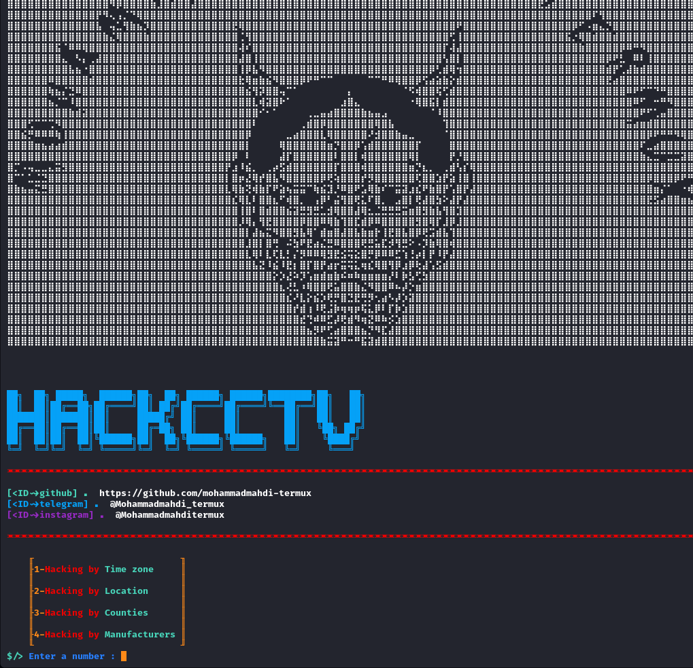

# hackCCTV


Note: ⚠️Mandatory update to fix bugs,please delete the previous version with the ```rm -r hackCCTV``` command and install the new version⚠️

### 🦭The cost of the tool is one star on MyGitHub🌟
## ID me📧

telegram
> https://t.me/Mohammadmahdi_termux

telergram chanle
> https://t.me/mohammadmahditermux_githubnews

instagram 
> @Mohammadmahditermux


## prerequisite🗃
```bash
python3
```
## Installation📥

```bash
rm -r hackCCTV
```

```bash
pkg update && pkg upgrade
```

```bash
git clone https://github.com/mohammadmahdi-termux/hackCCTV
```

```bash
cd hackCCTV
```

```bash
python3 hackcctv.py
```


## photo📷


<picture>
  <source media="(prefers-color-scheme: dark)" srcset="https://api.star-history.com/svg?repos=mohammadmahdi-termux/hackCCTV&type=Date&theme=dark" />
  <source media="(prefers-color-scheme: light)" srcset="https://api.star-history.com/svg?repos=mohammadmahdi-termux/hackCCTV&type=Date" />
  
</picture>
